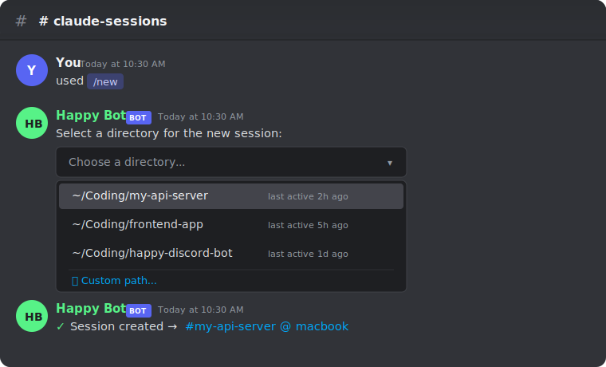
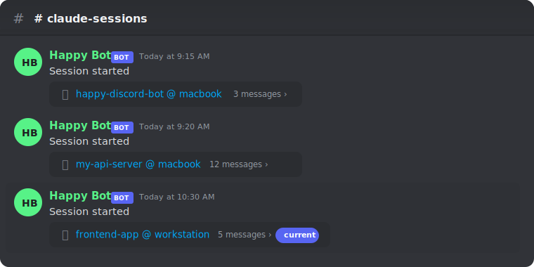
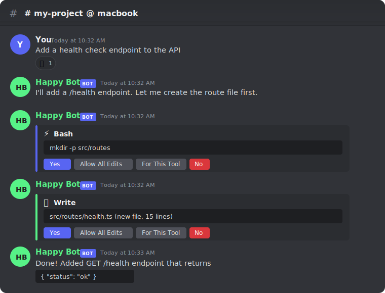
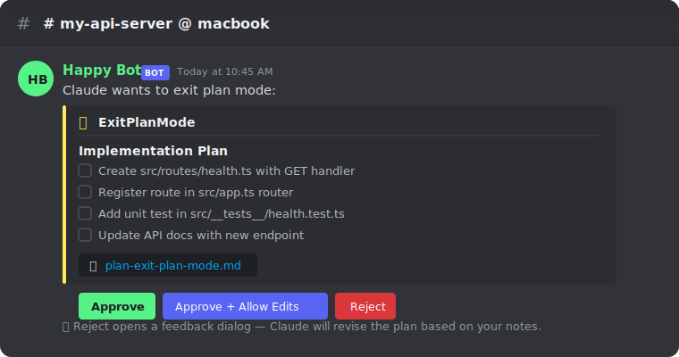

# Happy Discord Bot

Discord bot that gives you **full Claude Code HITL (Human-in-the-Loop) control from Discord** — review every tool call, approve plans, answer questions, and manage sessions, all without leaving your phone or browser.

```
Discord ←→ Bot ←→ Happy Relay ←→ happy CLI ←→ Claude Code
```

## Features

- **Full HITL control** — every Claude Code interaction surfaces in Discord: permission prompts, plan reviews, questions, and task progress
- **Permission approval** — per-operation buttons (Yes / Allow All Edits / For This Tool / No) with configurable auto-approve modes
- **Thread per session** — each Claude Code session maps to a Discord thread for parallel conversations
- **Interactive Q&A** — Claude's questions rendered as option buttons, answers sent as structured data
- **Plan review** — approve or reject plans with optional feedback
- **Task progress** — task list displayed and updated as a pinned message
- **Typing & emoji signals** — typing indicator + thinking/tool-call emoji reactions
- **Attachment upload** — Discord file attachments written to CLI working directory via RPC
- **Permission persistence** — permission state saved per session, restored on bot restart
- **Session management** — create, archive, delete sessions; batch cleanup of stale sessions
- **Usage tracking** — query token usage and cost per session or across all sessions
- **Built-in auth** — bot manages its own Happy account (`auth login` / `auth restore`)
- **Device approval** — `/approve` command to link new devices via `happy://` URL

## Prerequisites

- Node.js 20+
- `happy` CLI daemon running on the target machine for `/new` session creation
- A Discord Bot — follow the steps below if you don't have one

### 1. Create the bot

1. Go to [Discord Developer Portal](https://discord.com/developers/applications)
2. Click **New Application** → name it → **Create**
3. Go to **Bot** tab → click **Reset Token** → copy the token (this is your `DISCORD_TOKEN`)
4. Under **Privileged Gateway Intents**, enable **Message Content Intent**
5. Go to **General Information** tab → copy the **Application ID** (this is your `DISCORD_APPLICATION_ID`)

### 2. Invite the bot to your server

1. Go to **OAuth2** → **URL Generator**
2. Scopes: `bot`, `applications.commands`
3. Bot Permissions:

| Permission | Why |
|------------|-----|
| Send Messages | Send replies and status messages |
| Send Messages in Threads | Respond in session threads |
| Read Message History | Read context in threads |
| View Channels | Access the configured channel |
| Manage Messages | Pin/unpin task progress messages |
| Create Public Threads | Create session threads |
| Manage Threads | Archive/delete session threads |
| Add Reactions | Thinking/tool-call emoji signals |

Permission integer: `326417591360`

4. Copy the generated URL and open it in a browser to invite the bot

### 3. Get your IDs

Enable Developer Mode in Discord Settings → Advanced, then:

- **Channel ID**: right-click target channel → Copy Channel ID
- **User ID**: right-click yourself → Copy User ID
- **Guild ID**: right-click server name → Copy Server ID

## Quick Start

### 1. Install and configure the bot

```bash
npm install -g happy-discord-bot
happy-discord-bot init              # Prompts for DISCORD_TOKEN, channel/user/guild/app IDs
happy-discord-bot auth login        # Create Happy account (or `auth restore` with existing secret)
happy-discord-bot deploy-commands   # Register Discord slash commands
happy-discord-bot daemon start      # Run as background daemon
```

`init` saves config to `~/.happy-discord-bot/.env` (mode 0600). `auth login` generates a Happy account (secret + Ed25519 keypair) and saves credentials to `~/.happy-discord-bot/credentials.json`. If you already have a secret from another device, use `auth restore` instead.

### 2. Start a Claude Code session

The bot needs the `happy` daemon running to manage sessions. Install the CLI and start the daemon:

```bash
npm install -g @dragonkid/happy-coder   # Install happy CLI (fork with bot enhancements)
happy auth login                        # Select "Mobile App" → copy the happy:// URL
happy daemon start                      # Start background daemon
happy daemon status                     # Verify daemon is running
```

> **Linking:** When `happy auth login` shows the `happy://terminal?...` URL, run `/approve` in the bot's Discord channel and paste the URL. The bot will link the CLI to its account and the CLI will show "Authentication successful".

> **Why `@dragonkid/happy-coder`?** This is a fork of [slopus/happy](https://github.com/slopus/happy) with two enhancements needed for full bot HITL support:
> - **Structured AskUserQuestion answers** ([#803](https://github.com/slopus/happy/pull/803)) — passes selected options through permission RPC so Claude sees structured selections instead of free-text
> - **ExitPlanMode reject-with-feedback** ([#808](https://github.com/slopus/happy/pull/808)) — lets Claude continue re-planning after rejection with feedback instead of aborting

With both daemons running, use the `/new` Discord command to create sessions from any directory. Existing sessions are auto-discovered on bot startup.

### 3. Use in Discord

1. Run `/new` in the bot channel — pick a project directory to start a Claude Code session
2. The bot creates a thread (e.g. `my-project @ macbook`) — all conversation happens here
3. Type a message in the thread — it forwards to Claude Code, replies stream back
4. When Claude needs permission (file edit, shell command), approval buttons appear — click to approve or deny
5. Use `/stop` to abort, `/compact` to free context, `/mode` to change permission level

**Create a new session with `/new`:**



**Each session gets its own thread:**



**Permission approval with action buttons:**



**Plan review before implementation:**



## Configuration

### Happy credentials

**Option A: Built-in auth (recommended)**

```bash
happy-discord-bot auth login
```

Creates a new Happy account. The bot generates a 32-byte secret, derives an Ed25519 keypair, and registers with the relay server. Credentials are saved to `~/.happy-discord-bot/credentials.json` (mode 0600).

The command prints a backup key (base64url-encoded secret). **Save it** — you'll need it to restore access on another machine via `auth restore`.

After login, link the CLI by running `happy auth login` (select "Mobile App"), then use the `/approve` Discord command to paste the `happy://terminal?...` URL.

**Option B: Restore from existing secret**

```bash
happy-discord-bot auth restore
```

Prompts for a base64url-encoded secret (from a previous `auth login` backup or another device). Validates the secret length (32 bytes), authenticates with the relay, and saves credentials.

**Option C: Environment variables (CI/deployment)**

Set `HAPPY_TOKEN` and `HAPPY_SECRET` in your environment or `.env` file. These take precedence over `credentials.json`.

### Config resolution

The bot loads `.env` from the first location found:
1. `.env` in the current working directory
2. `~/.happy-discord-bot/.env` (created by `init`)

Override the state directory with `BOT_STATE_DIR` env var.

## Discord Commands

| Command | Description |
|---------|-------------|
| `/sessions` | List active sessions (active / archived), with thread links |
| `/stop` | Abort the current operation (thread-aware) |
| `/compact` | Compact session context (thread-aware) |
| `/mode <mode>` | Set permission mode (default / acceptEdits / bypass / plan) |
| `/new` | Create new session — pick directory or enter custom path |
| `/archive [session]` | Kill session process, preserve data, archive thread |
| `/delete [session]` | Permanently delete session + data + thread (with confirmation) |
| `/cleanup` | Batch delete archived sessions + orphan threads (with confirmation) |
| `/usage [period]` | Token usage & cost — session-scoped in threads, account-wide in channel |
| `/skills [name] [args]` | List, search, or invoke Claude Code skills/commands (with autocomplete) |
| `/loop <args>` | Run a prompt or skill on a recurring interval (e.g. `5m /compact`) |
| `/approve` | Link a new device to your Happy account via `happy://` URL |
| `/update` | Check for updates and upgrade the bot (safe dual-process handoff) |

Commands in a thread automatically resolve to that thread's session.

## CLI Reference

```
happy-discord-bot start              # Run bot (foreground, default)
happy-discord-bot daemon start       # Run as background daemon
happy-discord-bot daemon stop        # Stop daemon
happy-discord-bot daemon restart     # Restart daemon (stop + start)
happy-discord-bot daemon status      # Show daemon status + connected machines
happy-discord-bot update             # Check for updates and upgrade
happy-discord-bot init               # Interactive config setup
happy-discord-bot auth login         # Create new Happy account
happy-discord-bot auth restore       # Restore from existing secret
happy-discord-bot auth status        # Show credential status
happy-discord-bot auth logout        # Remove credentials
happy-discord-bot logs               # Tail daemon log output
happy-discord-bot deploy-commands    # Register Discord slash commands
happy-discord-bot version            # Show version
```

### Daemon mode

The daemon runs the bot as a detached background process. State is tracked in `~/.happy-discord-bot/daemon.state.json`.

Use `logs` to monitor the daemon after starting it — helpful for verifying connection status or diagnosing errors.

### Updating

Two ways to update to the latest version:

**From the CLI:**

```bash
happy-discord-bot update
```

Checks npm registry, installs the new version globally, and restarts the daemon if running.

**From Discord:**

Use the `/update` slash command. The bot performs a safe dual-process handoff:
1. Installs new version via `npm install -g`
2. Spawns new process with `--update-handoff`
3. New process connects to Discord + Happy relay
4. New process signals ready via file
5. Old process exits gracefully

Zero downtime — the new process is fully connected before the old one shuts down.

## How It Works

### Session discovery

On startup, the bot:
1. Lists all active sessions from the relay API
2. Creates a Discord thread for each session (named `{directory} @ {host}`)
3. Replays any pending permission requests as buttons
4. Auto-selects the most recently active session

### Thread routing

Each session gets its own Discord thread. Messages in a thread auto-route to the bound session — no need to switch context. Messages in the main channel go to the active session (set via `/sessions` or on startup).

### Permission approval

When Claude Code wants to run a tool (edit a file, execute a command, etc.), the bot shows approval buttons:

- **Yes** — approve this single operation
- **Allow All Edits** — auto-approve all edit tools for this session
- **For This Tool** — auto-approve this specific tool going forward
- **No** — deny the operation

Use `/mode` to change the default permission mode:

| Mode | Behavior |
|------|----------|
| `default` | Ask for every tool call |
| `acceptEdits` | Auto-approve file edits, ask for everything else |
| `bypass` | Auto-approve all operations |
| `plan` | Require plan approval before implementation |

Permission state persists per session — survives bot restarts.

## Development

### From source

```bash
git clone https://github.com/dragonkid/happy-discord-bot
cd happy-discord-bot
npm install
cp .env.example .env                # Edit with your credentials
npm run deploy-commands
npm run dev
```

### Environment variables

| Variable | Required | Description |
|----------|----------|-------------|
| `DISCORD_TOKEN` | Yes | Discord Bot token |
| `DISCORD_CHANNEL_ID` | Yes | Target channel ID |
| `DISCORD_USER_ID` | Yes | Your Discord user ID |
| `DISCORD_APPLICATION_ID` | Yes* | Application ID |
| `DISCORD_GUILD_ID` | Yes | Guild (server) ID — for instant slash command deployment |
| `DISCORD_REQUIRE_MENTION` | No | Require @bot mention to forward messages (default: `false`) |
| `HAPPY_TOKEN` | No** | Happy API token (env-based auth) |
| `HAPPY_SECRET` | No** | Happy account secret, base64 (env-based auth) |
| `HAPPY_SERVER_URL` | No | Override relay URL (default: `https://api.cluster-fluster.com`) |
| `BOT_STATE_DIR` | No | Directory for state persistence (default: `~/.happy-discord-bot`) |

\* Required for `npm run deploy-commands`.
\*\* Alternative to `auth login` — for CI/deployment where interactive auth isn't possible.

### npm scripts

```bash
npm run dev              # Development with tsx
npm run build            # Compile TypeScript to dist/
npm start                # Run compiled JS
npm run deploy-commands  # Register Discord slash commands (run once)
npm run lint             # ESLint
npm run lint:fix         # ESLint auto-fix
npm test                 # Run tests (vitest)
npm run test:watch       # Run tests in watch mode
npm run test:e2e         # E2E smoke tests (requires .env.e2e, real services)
```

### Testing

Unit/integration tests use Vitest with all external dependencies mocked:

```bash
npm test                 # 27 suites, 600 tests
```

E2E smoke tests require a second Discord bot, a dedicated test channel, and a running `happy` daemon. See `e2e/` directory and `.env.e2e.example` for setup.

```bash
npm run test:e2e
```
